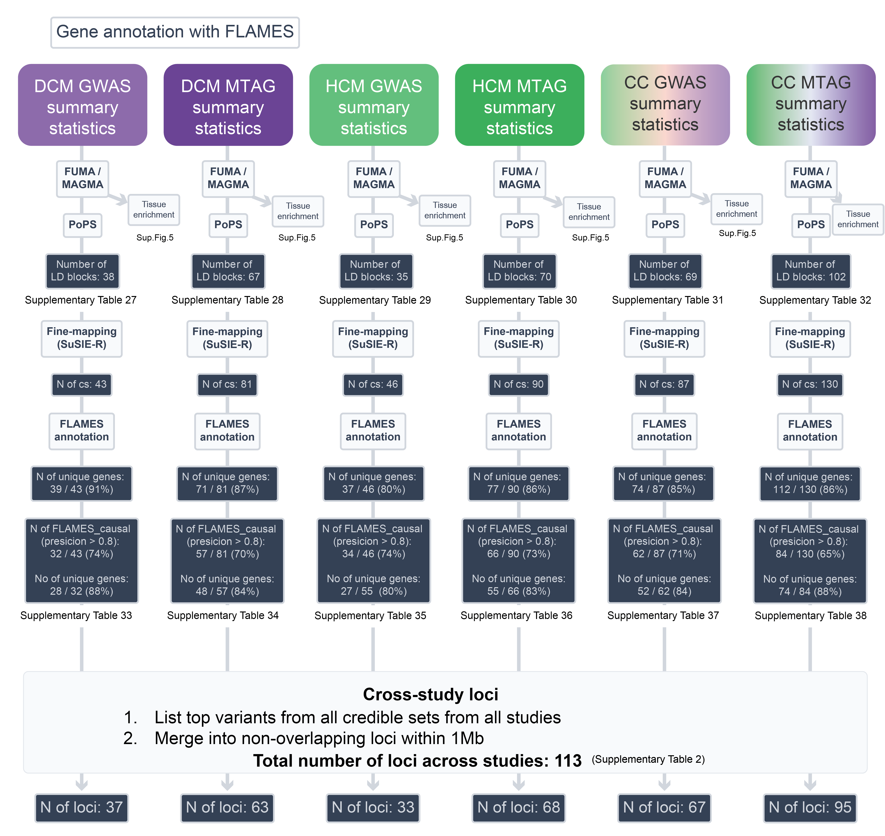
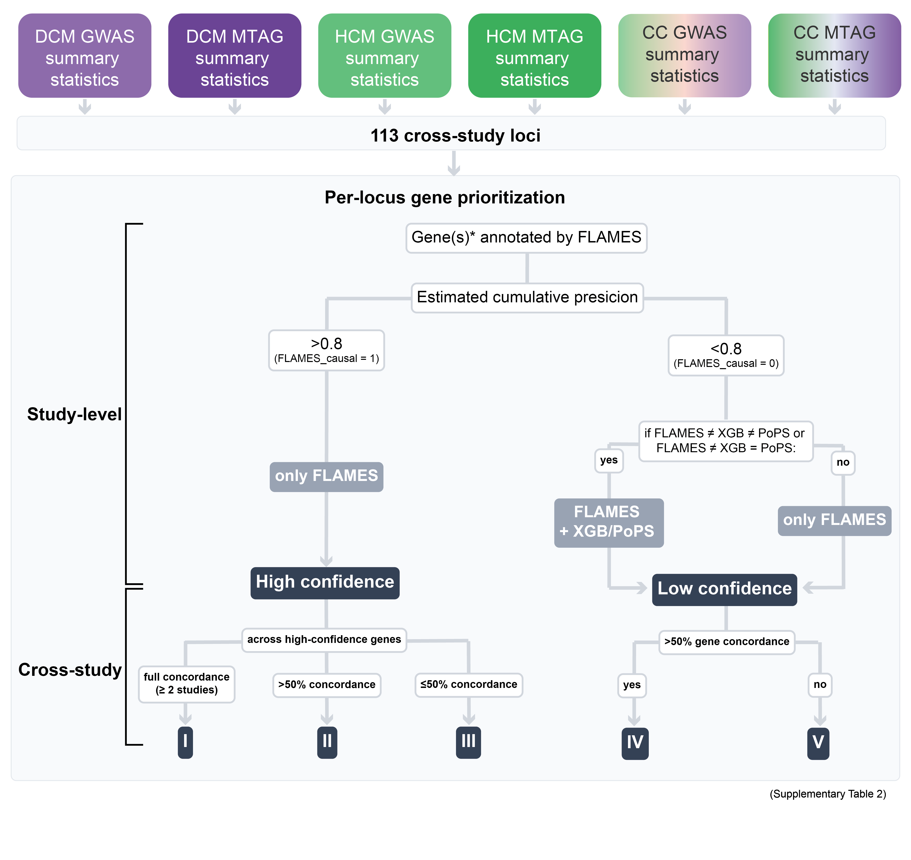

# Leveraging shared and opposing genetic mechanisms in heritable cardiomyopathies

<!-- echo "[INFO] Saving conda environment..."
conda env export > "${OUTDIR}/environment_LAVA_2024.yml" 
conda list
-->

Internal code and data layout for the project **shared_opposing_mechanisms_cmp**.

This repository documents the analysis pipeline and scripts used in the manuscript
"Leveraging the shared and opposing genetic mechanisms in the heritable cardiomyopathies".

All figures are generated using R (v4.3.1) and the tidyverse / Bioconductor ecosystem.  
Detailed documentation for specific figure inputs can be found in: [`README_figures.md.sh`](README_figures.md.sh) 

## Table of Contents

- [Step 1 – Obtain DCM and HCM GWAS summary statistics](#step-1--obtain-dcm-and-hcm-gwas-summary-statistics)
- [Step 2 – Summary of QC for processed summary statistics (DCM/HCM)](#step-2--summary-of-qc-for-processed-summary-statistics-dcmhcm)
- [Step 3 – Genetic correlations](#step-3--genetic-correlations)
  - [3.1 Global genetic correlation (LDSC)](#31-global-genetic-correlation-rg)
  - [3.2 Local genetic correlation (LAVA)](#32-local-genetic-correlation-lava)
- [Step 4 – Case–case analyses (CC-GWAS & CC-MTAG)](#step-4--casecase-analyses-cc-gwas--cc-mtag)
  - [4.1 Inputs](#41-inputs)
  - [4.2 Run CC-GWAS](#42-Run-CC-GWAS)
  - [4.3 MTAG installation (Python 2.7)](#43-mtag-installation-python-27)
  - [4.4 CC-MTAG analysis](#44-cc-mtag-analysis)
    - [Round 1 – Multivariate architecture scan across all MRI traits](#round-1--multivariate-architecture-scan-across-all-MRI-traits)
    - [Round 2 – Focused CC–MTAG with FDR (Ecc, LVESVi, LVconc)](#round-2--focused-cc-mtag-with-fdr-Ecc-LVESVi-LVconc)
- [Step 5 – Locus definitions, variant annotation and gene prioritization](#step-5--locus-definitions-variant-annotation-and-gene-prioritization)
  - [5.1 Gene prioritization](#51-gene-prioritization)
  - [5.2 Consolidation across studies](#52-consolidation-across-studies)
    - [5.2.1 Locus definition](#521-locus-definition)
    - [5.2.2 Gene prioritization per study](#522-gene-prioritization-per-study)
    - [5.2.3 Gene prioritization across studies](#523-gene-prioritization-across-studies)
- [Step 6 – Cell type analyses using snRNAseq](#step-6--cell-type-analyses-using-snrnaseq)
- [Step 7 – Pathway / Tissue Enrichment](#step-7--pathway--tissue-enrichment)
- [Step 8 – Partitioned heritability](#step-8--partitioned-heritability)
  - [8.1 Environment and paths](#81-environment-and-paths)
  - [8.2 Define ±250kb loci](#82-define-250kb-loci)
  - [8.3 Create LDSC annotation files](#83-create-ldsc-annotation-files)
  - [8.4 Compute LD scores](#84-compute-ld-scores)
  - [8.5 Partitioned heritability results](#85-partitioned-heritability-results)
- [Step 9 – Druggability annotation of prioritized genes](#step-9--druggability-annotation-of-prioritized-genes)
- [Step 10 – Polygenic scores (DCM/HCM/CC)](#step-10--polygenic-scores-dcmhcmcc)
- [Step 11 – Shared-effect meta-analysis](#step-11--shared-effect-meta-analysis)
  - [Stage 1 – Fixed-effects meta-analysis](#stage-1--fixed-effects-meta-analysis)
  - [Stage 2 – Random-effects meta-analysis](#stage-2--random-effects-meta-analysis)
## Directory layout (high level)

- `code/` – all analysis scripts (R, Bash, etc.)
- `data/` –  input data

---

## Step 1 – Obtain DCM and HCM GWAS summary statistics

1. Identify the two primary GWAS datasets:
   - DCM GWAS summary statistics from: https://www.nature.com/articles/s41588-024-01975-5
    Summary statistics for our GWAS meta-analyses have been made available for download through the Cardiovascular Disease Knowledge Portal (https://cvd.hugeamp.org/downloads.html)

   - HCM GWAS summary statistics from: https://www.nature.com/articles/s41588-025-02087-4
     Full GWAS summary statistics of HCM, HCMSARC−, HCMSARC+, MTAG and ten LV traits are available on the GWAS catalog (accession IDs GCST90435254 (https://www.ebi.ac.uk/gwas/studies/GCST90435254) –GCST90435267(https://www.ebi.ac.uk/gwas/studies/GCST90435267))


## Step 2 — Summary of QC for processed summary statistics (DCM/HCM)

QC filters:

1. Effect allele frequency filter:  
   - `EAFREQ >= 0.005 & EAFREQ <= 0.995`

2. Sample-size filters:  
   - For DCM GWAS: `N_cases >= 0.7 * max(N_cases)` 
   - For DCM MTAG: `N_Neff >= 0.7 * max(N_Neff)`
   - For HCM GWAS: `N_cases >= 0.96 * max(N_cases)`  
   - For HCM MTAG: `N_Neff >= 0.96 * max(N_Neff)` 

3. Exclusion of MHC-like extended region on chromosome 11:  
   - DCM: exclude variants with `CHR == 11 & POS ∈ [29,978,453; 80,288,956]`  
   - HCM: exclude variants with `CHR == 11 & POS ∈ [30,000,000; 80,000,000]`

Output: 
- harmonized_dcm.tsv.gz
- harmonized_hcm.tsv.gz
---
## Step 3 — Genetic correlations

### 3.1 Global genetic correlation (rg)

Estimation of univariate SNP-heritability and bivariate genetic correlation using LD Score Regression (LDSC).

#### 3.1.1 LDSC software
We use LD Score Regression from Bulik-Sullivan et al. (LDSC (LD SCore) v1.0.1)
Repository: https://github.com/bulik/ldsc

##### 3.1.2 Munging 

Example script: [`code/example_munging.sh`](code/example_munging.sh)

##### 3.1.3 LDSC Genetic Correlation 
Example script: [`code/example_ldsc_rg.sh`](code/example_ldsc_rg.sh)

##### 3.1.4 Figure 2a: Genetic correlation heatmap (DCM–HCM + MRI traits):
Iput: ST3 Genetic correlations: DCM, HCM & cardiac MRI traits
Output: Figure 2a

Example script:  [`code/figure2a.r`](code/figure2a.R)

##### 3.1.4 Figure 2b: SNP effect concordance between DCM and HCM:
Input: ST4 Comparison of lead variant effects: DCM vs HCM
Output: Figure 2b

Example script: [`code/figure2b.r`](code/figure2a.R)

### 3.2 Local genetic correlation (LAVA)

LAVA was executed in a dedicated conda environment (`LAVA_2024`) to ensure consistent versions of PLINK, PLINK2, bcftools, and supporting R packages. Details and additional input files and script examples here: https://github.com/josefin-werme/LAVA 

Version used for our paper: https://github.com/josefin-werme/LAVA/releases/tag/v0.1.0 

#### 3.2.1 Activate environment

Environemts for LAVA: [`env/environment_LAVA_2024.yml`](env/environment_LAVA_2024.yml)

```bash
conda activate LAVA_2024
# R version (used for LAVA)
conda install -c bioconda r-base=4.4
```

```R
# Install LAVA from GitHub
install.packages("remotes")
remotes::install_github("josefin-werme/LAVA")
```

#### 3.2.2 Input Configuration File for LAVA

LAVA requires a simple tab-delimited configuration file specifying, for each phenotype: [`data/LAVA/input.info.txt`](data/input.info.txt)

#### 3.2.3 Example script: [`code/run_lava_local_rg.r`](code/run_lava_local_rg.R)

#### 3.2.4 Figures 2d and 2f (LAVA locus annotation and Manhattan-type plots)
Iput: ST5 LAVA univariate & bivariate local rg across DCM/HCM loci
Output: Figure 2d, Figure 2f
## Step 4 – Case–case analyses (CC-GWAS & CC-MTAG)


### 4.1 Inputs

This analysis requires harmonised DCM and HCM GWAS summary statistics as produced in Step 2 of the pipeline:
    - `harmonized_dcm.tsv.gz`
    - `harmonized_hcm.tsv.gz`

Cardiac MRI traits for MTAG come from the cardiac MRI GWAS ([`Tadros et al.`](https://www.nature.com/articles/s41588-024-01975-5)). 

### 4.2 Run CC-GWAS

CC-GWAS contrasts the genetic architectures of DCM and HCM directly, modelling them as two case-control traits. This identifies variants with differential genetic effects.

Inputs for CC-GWAS:

- Harmonized DCM GWAS (with effective sample size Neff_p0.5)
- Harmonized HCM GWAS
- Prevalence estimates (population level + plausible bounds)
- LDSC-derived parameters:
    - SNP-heritability (DCM: ~0.142; HCM: ~0.1798)
    - DCM–HCM genetic correlation (≈ –0.5642)
    - Intercept (≈ 0.0107)
    - Number of causal SNPs (m ≈ 1200, based on typical polygenicity values)

CC-GWAS software (R package) is available at https://github.com/wouterpeyrot/CCGWAS 
The CC-GWAS method is described in detail in [`Peyrot & Price. 2021 Nature Genetics`](https://www.nature.com/articles/s41588-021-00787-1)

Code for the DCM and HCM CC GWAS: [`run_ccgwas.r`](code/run_ccgwas.r) (MYBPC3 region (chr11:30–80 Mb) removed)

### 4.3 MTAG installation (Python 2.7)

MTAG is installed in a dedicated directory and conda environment.  
Full installation steps are documented in:

[`code/setup_mtag_ccgwas.sh`](code/setup_mtag_ccgwas.sh)

In brief, we:

- clone the original MTAG repository (Python 2.7),
- create a dedicated conda environment (`env_python2.7`),
- install `numpy`, `scipy`, `pandas` and MTAG’s Python dependencies,
- test the installation with `mtag.py -h`.

All CC–MTAG analyses below are run inside this `env_python2.7` environment.

---

### 4.4 4.4 CC-MTAG analysis

We used MTAG to model **CC-GWAS (DCM vs HCM)** jointly with cardiac MRI traits from Tadros et al., in two stages:

1. **Round 1 — Multivariate architecture scan**  
   Run MTAG across CC-GWAS and a broad set of MRI traits to identify traits with the highest genetic correlation (most informative multivariate partners).

2. **Round 2 – Focused CC–MTAG with FDR**  
   Restrict MTAG to CC-GWAS and a subset of MRI traits (Ecc, LVESVi, LVconc) and compute false discovery rate (FDR) for CC–MTAG loci.

#### 4.4.1 Inputs

Files:

- `sum_stats/CC_GWAS__DCM__HCM_forMTAG.txt`  
  – CC-GWAS summary statistics pre-formatted for MTAG.

- `sum_stats/Ecc_global_for_MTAG.txt`  
- `sum_stats/Ell_global_for_MTAG.txt`  
- `sum_stats/Err_global_for_MTAG.txt`  
- `sum_stats/LVEF_for_MTAG.txt`  
- `sum_stats/LVEDVi_for_MTAG.txt`  
- `sum_stats/LVESVi_for_MTAG.txt`  
- `sum_stats/LVMi_for_MTAG.txt`  
- `sum_stats/LVconc_for_MTAG.txt`  
- `sum_stats/maxWT_for_MTAG.txt`  
- `sum_stats/meanWT_for_MTAG.txt`  

  – cardiac MRI traits from Tadros et al., harmonised and formatted for MTAG.

#### 4.4.2 Round 1 – Multivariate architecture (scan across all MRI traits)

```bash
conda activate env_python2.7

mtag/mtag.py \
  --sumstats \
    sum_stats/CC_GWAS__DCM__HCM_forMTAG.txt,\
    sum_stats/Ecc_global_for_MTAG.txt,\
    sum_stats/Ell_global_for_MTAG.txt,\
    sum_stats/Err_global_for_MTAG.txt,\
    sum_stats/LVEF_for_MTAG.txt,\
    sum_stats/LVEDVi_for_MTAG.txt,\
    sum_stats/LVESVi_for_MTAG.txt,\
    sum_stats/LVMi_for_MTAG.txt,\
    sum_stats/LVconc_for_MTAG.txt,\
    sum_stats/maxWT_for_MTAG.txt,\
    sum_stats/meanWT_for_MTAG.txt \
  --out ./CC_GWAS__DCM__HCM__MTAG_ALL \
  --beta_name beta \
  --snp_name snpid \
  --se_name se \
  --z_name z \
  --n_name n \
  --eaf_name freq \
  --n_min 0.0 \
  --a1_name a1 \
  --a2_name a2 \
  --p_name pval \
  --stream_stdout
```

#### 4.4.3 Round 2 – Focused CC–MTAG with FDR (Ecc, LVESVi, LVconc)

Based on Round 1, we restrict CC–MTAG to CC-GWAS and three MRI traits (Ecc, LVESVi, LVconc) and compute FDR across traits.

```bash
conda activate env_python2.7

mtag/mtag.py \
  --sumstats \
    sum_stats/CC_GWAS__DCM__HCM_forMTAG.txt,\
    sum_stats/Ecc_global_for_MTAG.txt,\
    sum_stats/LVESVi_for_MTAG.txt,\
    sum_stats/LVconc_for_MTAG.txt \
  --out ./CC_GWAS__DCM__HCM__MTAG_Ecc_LVESVi_LVconc \
  --beta_name beta \
  --snp_name snpid \
  --se_name se \
  --z_name z \
  --n_name n \
  --eaf_name freq \
  --n_min 0.0 \
  --a1_name a1 \
  --a2_name a2 \
  --p_name pval \
  --fdr \
  --stream_stdout
```
## Step 5 – Locus definitions, variant annotation and gene prioritization

### 5.1 Gene prioritization

This section describes the full pipeline used to define genomic loci, annotate fine-mapped variants, and prioritize effector genes across all GWAS datasets used in this project (DCM GWAS, HCM GWAS, CC-GWAS, and corresponding MTAG results).

We use established functional genomics tools including **FUMA**, **MAGMA**, **PoPS**, **SuSiE-R**, and **FLAMES**, following best practices and the tutorial at:  
https://github.com/Marijn-Schipper/FLAMES

---

#### Workflow Overview

Gene prioritization was performed in four integrated stages:

1. **FUMA/MAGMA analysis**  
2. **PoPS gene scoring**  
3. **Fine-mapping with SuSiE-R**  
4. **FLAMES variant-to-gene integration and ranking**

Because FUMA and PoPS operate on **GRCh37**, while UK Biobank LD reference panels are **GRCh38**, liftover and allele flipping were required to harmonize inputs.

---

#### 5.1.1 FUMA, MAGMA, PoPS, and SuSiE-R

##### FUMA & MAGMA

Each summary statistic dataset was analyzed using **FUMA v1.6.1** (https://fuma.ctglab.nl), which performs:

- MAGMA v1.08 gene-based analysis  
- MAGMA tissue enrichment (GTEx v8)  
- functional mapping of index variants  
- chromatin and eQTL annotations  

These results (MAGMA Z-scores, tissue enrichment, positional mapping files) serve as input for **PoPS** and **FLAMES**.

##### PoPS scoring

PoPS (https://github.com/FinucaneLab/pops) was run using the full feature matrix and MAGMA scores:

```bash
python ${POPS_TOOL}/pops/pops.py \
  --verbose \
  --gene_annot_path ${POPS_TOOL}/pops/example/data/utils/gene_annot_jun10.txt \
  --feature_mat_prefix ${POPS_TOOL}/POPs_f_Joel_munged/munged \
  --num_feature_chunks 1155 \
  --magma_prefix ${WD_PROJECT}/data/FUMA/${FUMA_result_folder}/magma \
  --out_prefix ${WD_PROJECT}/data/FUMA/${FUMA_result_folder}/POPS/out
```

Outputs include PoPS raw and normalized gene scores (*.preds), which are later used by FLAMES.

##### SuSiE-R Fine-mapping

Fine-mapping was performed using SuSiE-R v0.12.35, separately in each UK Biobank LD block.
Default min_abs_corr = 0.5 was used unless SuSiE failed to converge, in which case it was relaxed to 0.25.

Example code
```R
summarized_files <- dat %>%
  group_by(file) %>%
  mutate(
    chr_LD = str_extract(file, "(?<=chr)[0-9]+"),
    start_LD = as.numeric(str_extract(file, "(?<=snp\\.)[0-9]+(?=_)")),
    end_LD = as.numeric(str_extract(file, "(?<=_)[0-9]+(?=\\.Rvar)")),
    loci_n = row_number(),
    LD_edge_low = min_BP_38 - 5e5,
    LD_edge_high = max_BP_38 + 5e5
  ) %>%
  arrange(file)
```
```R

  min_abs_corr <- 0.5 # or 0.25 if 0.5 did not produce any cs
  fitted_rss <- susie_rss(bhat = subset_final_sumst_1$BETA, 
                          shat = subset_final_sumst_1$SE, 
                          R = ld_matrix_subset, 
                          n = N_CC, L = susie_l,
                          min_abs_corr = min_abs_corr)
```

Fine-mapping outputs for each sumstats:
- 95% credible sets (CS1, CS2, …)
- SuSiE posterior inclusion probabilities (PIP)
- Number of SNPs per CS
- LD block coordinates
- SuSiE convergence status

Tables:
ST25 SuSiE LD intervals for DCM GWAS
ST27 SuSiE LD intervals for HCM GWAS
ST29 SuSiE LD intervals for DCM MTAG
ST31 SuSiE LD intervals for HCM MTAG
ST33 SuSiE LD intervals for CC GWAS
ST35 SuSiE LD intervals for CC MTAG

| Column                | Description                  |
| --------------------- | ---------------------------- |
| file                  | UKBB LD matrix used          |
| num_SNP               | number of SNPs in the block  |
| chr_LD                | LD block chromosome          |
| start_LD / end_LD     | LD block boundaries          |
| LD_region_n           | block index                  |
| LD_region_start / end | fine-mapping window          |
| susier                | 1 = successful, 2 = fallback |
| min_abs_corr          | threshold used               |
| cs_n                  | number of SNPs in CS         |


#### 5.1.2 FLAMES

To perform gene prioritization, we used the recently-described ‘fine-mapped locus assessment model of effector genes’ (FLAMES) approach (v1.1.1). FLAMES combines two main approaches to gene prioritization in a weighted framework to compute causal gene predictions that outperform prior methods. In particular, FLAMES first uses pre-fit machine learning models (based on XG-Boost) to link fine-mapped variants to likely effector genes based on various parameters including variant-to-gene distance, epigenomic context, and quantitative trait loci. Second, FLAMES uses the Polygenic Priority Score (PoPS) method to learn gene features associated with the trait based on functional networks; features consist of cell-type-specific gene expression, biological pathways and protein–protein interactions (PPIs). 
We then applied the FLAMES framework to each of our GWAS datasets. To this end, for a given GWAS dataset, we first ran PoPS (v0.2), using the MAGMA Z-scores as input and using the full feature matrix provided by the PoPS developers. We then annotated each credible set using the annotate module from FLAMES, which combines variant-to-gene mappings, MAGMA Z-scores, PoPS scores, and GTEx tissue enrichment data.

FLAMES then returned a ranked list of genes per locus, including raw and scaled FLAMES scores, XG-Boost scores, PoPS scores, and estimated cumulative precision. This metric reflects the expected accuracy of gene prioritization at a given threshold. An estimated cumulative precision of 0.8 would indicate that prioritizing genes at or above the threshold of that locus, the set on average would be 80% precise.

```bash
conda activate FLAMES

export PATH_TO_DOWNLOADED_FEATURES="/home/dkramarenk/projects/tools/POPs/POPs_f_Joel_munged"
export PATH_TO_GENERATED_MAGMA_Z_SCORES="${WD_PROJECT}/data/FUMA/FUMA_${FUMA_result_folder}/magma"
export DESIRED_POPS_OUTPUT_PREFIX="${WD_PROJECT}/data/FUMA/FUMA_${FUMA_result_folder}/POPS/out"
export DESIRED_OUTPUT_DIRECTORY="${WD_PROJECT}/FLAMES_out/${FUMA_result_folder}/"
export PATH_TO_THE_DOWNLOADED_ANNOTATION_DATA_DIRECTORY="/home/dkramarenk/projects/tools/POPs/Annotation_data/"
export PATH_TO_INDEXFILE="${WD_PROJECT}/data/SUSIE/${FUMA_result_folder}/out/FLAMES_index.ind"

if [ ! -d "${WD_PROJECT}/FLAMES_out/${FUMA_result_folder}" ]; then
  echo "Creating directory ${WD_PROJECT}/FLAMES_out/${FUMA_result_folder}"
  mkdir -p ${WD_PROJECT}/FLAMES_out/${FUMA_result_folder}
fi

python ${WD_PROJECT}/FLAMES/FLAMES.py annotate \
-o $DESIRED_OUTPUT_DIRECTORY \
-a $PATH_TO_THE_DOWNLOADED_ANNOTATION_DATA_DIRECTORY \
-p ${DESIRED_POPS_OUTPUT_PREFIX}.preds \
-m ${PATH_TO_GENERATED_MAGMA_Z_SCORES}.genes.out \
-mt ${PATH_TO_GENERATED_MAGMA_Z_SCORES}.gsa.out \
-id $PATH_TO_INDEXFILE
```

```bash
conda activate FLAMES

export INDEX_FILE_NCLUDING_COLUMN="${WD_PROJECT}/data/SUSIE/${FUMA_result_folder}/out/FLAMES_index.ind"
export DESIRED_OUTPUT_DIRECTORY="${WD_PROJECT}/FLAMES_out/${FUMA_result_folder}/"

python ${WD_PROJECT}/FLAMES/FLAMES.py FLAMES \
-id $INDEX_FILE_NCLUDING_COLUMN \
-o $DESIRED_OUTPUT_DIRECTORY
```
---

### 5.2 Consolidation across studies

To ensure consistent genomic locus boundaries across all analyses, loci were defined using a unified procedure applied to each GWAS and MTAG dataset.



#### 5.2.1 Locus definition

1. **Select index variants**
   - Highest PIP SNP from SuSiE fine-mapping, **or**
   - Lowest P-value SNP if SuSiE did not converge.

2. **Sort all index variants** by `CHR:BP`.

3. **Merge nearby index variants**
   - Variants located within **±500 kb** of each other were merged into a single locus  
     (**1 Mb window**).

4. **Assign a unique locus ID**
   - Locus IDs were kept consistent across all datasets.
   - Final locus numbering is provided in **ST2 Summary of locus discovery & gene prioritization across studies**.

**Datasets harmonized under this scheme**

- DCM GWAS  
- HCM GWAS  
- CC-GWAS
- DCM MTAG  
- HCM MTAG  
- CC–MTAG  

This strategy ensures that all analyses reference the same set of genomic loci.

---

#### 5.2.2 Gene prioritization per study

At the study level, loci with cumulative precision >0.8 (FLAMES_causal = 1) were classified as high confidence, relying on FLAMES-only prioritization. Loci with cumulative precision <0.8 (FLAMES_causal = 0) were classified as low confidence; for these, gene prioritization incorporated additional methods (XGB and PoPS) when discordant with FLAMES, or defaulted to FLAMES-only when concordant.



#### 5.2.3 Gene prioritization across studies

After study-level prioritization, a second prioritization step was applied across studies at each locus. The aim of this step was to organize candidate genes according to the strength and consistency of evidence across analyses. Genes were assigned into five mutually exclusive confidence levels, ordered from strongest to weakest support.

**Level I: full concordance across high-confidence studies** 
Genes were assigned to Level I if they were present in all studies with a high-confidence annotation, that is, in all studies in which the locus contained at least one variant with FLAMES_causal = 1. Only studies with high-confidence annotations contributed to this assessment. Studies without a FLAMES causal signal were ignored.

**Level II partial concordance across high-confidence studies** 
Genes were assigned to Level II if they were present in more than 50% of studies with a high-confidence annotation, but not in all. When only one study provided a high-confidence annotation for a given locus, the corresponding gene or genes were assigned to Level II rather than Level I to avoid overestimation of cross-study consistency from a single observation. Only studies with high-confidence annotations contributed to this assessment. Studies without a FLAMES causal signal were ignored.

**Level III: additional high-confidence genes** 
Genes were assigned to Level III if they originated from high-confidence studies but were not already captured by Level I or Level II. Thus, this level reflects genes supported by at least one high-confidence study, but without sufficient concordance to meet the criteria for full or partial agreement across studies.

**Level IV: recurrent low-confidence genes across studies** 
Genes were assigned to Level IV if they arose from low-confidence study-level prioritization and recurred in > 50% of studies. Specifically, low-confidence study-level prioritized genes were compared across all studies in which the locus was detected, and genes present in at least two studies were assigned to this level, after excluding any genes already assigned to higher-confidence levels.

**Level V: remaining low-confidence genes** 
Genes were assigned to Level V if they arose from low-confidence study-level prioritization but were not recurrent across studies and had not been assigned to Levels I–IV. These genes represent the weakest level of support in the framework.
To ensure interpretability, the five cross-study confidence levels were made mutually exclusive. Genes assigned to a higher-confidence level were removed from all lower-confidence levels. Thus, each gene appeared only once per locus and was reported at the highest level of evidence it achieved.

## Step 6 – Cell type analyses using snRNAseq data
Using the cell type-specific gene expression profiles, we then performed heritability enrichment analyses using the sc-linker pipeline (https://github.com/kkdey/GSSG) and preprocessed snRNA-seq data obtained from Reichart et al., 2022.
## Step 7 – Pathway / Tissue Enrichment 

We performed enrichment analysis on prioritized genes using **g:Profiler** and summarized results in a volcano-style plot, integrating:

- g:Profiler term statistics (GO, KEGG, Reactome, etc.) (link: https://biit.cs.ut.ee/gprofiler/gost)
- **REVIGO** clustering of GO terms (BP, CC, MF) (details: https://github.com/rajko-horvat/RevigoWeb)
- Computed **odds ratios (OR)** for each term (Rscript)
- Volcano plots (Figure 4d,f)

---

### 7.1 Inputs

- **g:Profiler results**: 
    - CC GWAS genes [`data/gprofiler_cc_novel/gProfiler_hsapiens_4-10-2026_12-00-38 PM__intersections`](data/gProfiler_hsapiens_06-02-2025_14-44-58__intersections.csv)
    ST8 Pathway enrichment of prioritized CC GWAS genes

    - novel CC genes: [`data/gprofiler_cc_novel/gProfiler_hsapiens_2026-05-26_09-26-55__intersections`](data/gProfiler_unique_hsapiens_06-02-2025_17-09-06__intersections.csv)
    ST10 Pathway enrichment of novel CC-prioritized genes

- **REVIGO GO tables**:
  - [`data/gprofiler_cc_novel/Revigo_BP_Table.tsv`](data/gprofiler_cc_novel/Revigo_BP_Table.tsv)
  - [`data/gprofiler_cc_gwas/Revigo_BP_Table.tsv`](data/gprofiler_cc_gwas/Revigo_BP_Table.tsv)
  - [`data/gprofiler_cc_novel/Revigo_CC_Table.tsv`](data/gprofiler_cc_novel/Revigo_CC_Table.tsv)
  - [`data/gprofiler_cc_gwas/Revigo_CC_Table.tsv`](data/gprofiler_cc_gwas/Revigo_CC_Table.tsv)
  - [`data/gprofiler_cc_novel/Revigo_MF_Table.tsv`](data/gprofiler_cc_novel/Revigo_MF_Table.tsv)
  - [`data/gprofiler_cc_gwas/Revigo_MF_Table.tsv`](data/gprofiler_cc_gwas/Revigo_MF_Table.tsv)

---

### 7.2 R Script: `code/tissue_enrichment_volcano.r`

This script:

1. Computes **odds ratios (OR)** for each g:Profiler term.
2. Uses REVIGO tables to map each term to a **representative group ID / name**.
3. Selects **top terms per source** for annotation.
4. Produces a **volcano-style plot** (Figure 4d,f) (OR vs –log10(adjusted p)) with labels.
## Step 8 – Partitioned heritability

We quantified how much SNP heritability of DCM and HCM is concentrated in loci identified by the CC-GWAS and CC–MTAG analyses, using partitioned heritability in LDSC.  
LDSC installation and munging follow Sections **3.1.1** and **3.1.2**.  
Official tutorial: <https://github.com/bulik/ldsc/wiki/Partitioned-Heritability>

Below is an example workflow using **CC_GWAS** and **CC_MTAG** loci as custom annotations.

For each case–case dataset (CC_GWAS and CC_MTAG) we:
- Extract SNPs with P < 5×10⁻⁸.
- Create ±250 kb windows around each SNP.
- Merge overlapping windows per dataset.
- Combine CC_GWAS and CC_MTAG windows into a shared locus annotation.

Results in ST9 Partitioned heritability of CC loci

### 8.1 Environment and paths

```bash
# Project and tools
PROJECT_DIR=/path/to/project                      # e.g. /home/user/projects/shared_opposing_mechanisms_cmp
TOOLS_DIR=/path/to/tools                          # directory containing ldsc/ and reference files
LDSC_DIR=${TOOLS_DIR}/ldsc
LDSC_REF_PLINK=${TOOLS_DIR}/LDSC_files/1000G_EUR_Phase3_plink
LDSC_REF_FRQ=${TOOLS_DIR}/LDSC_files/1000G_Phase3_frq
LDSC_REF_WEIGHTS=${TOOLS_DIR}/LDSC_files/1000G_Phase3_weights_hm3_no_MHC
LDSC_BASELINE=${TOOLS_DIR}/LDSC_files/baselineLD.

# Sumstats (munged, LDSC-ready)
SUMST_DIR=${PROJECT_DIR}/data/sumst_processed/ldsc/MUNGE

# Output directory for annotations and LDS scores
ANNOT_DIR=${PROJECT_DIR}/data/sumst_processed/ldsc/PART/annot_shared_ld
mkdir -p "${ANNOT_DIR}"

# Bedtools (or ensure it is in $PATH)
BEDTOOLS=bedtools

# Traits / loci labels
loci_GWAS="CC_GWAS"
loci_MTAG="CC_MTAG"
```

### 8.2 Define ±250 kb loci

```bash
cd "${PROJECT_DIR}"

# 1a. Create per-trait BED files with ±250 kb windows around GWS SNPs
for name in ${loci_GWAS} ${loci_MTAG}; do
  in_file="${PROJECT_DIR}/data/sumst_processed/${name}_37_exclMYBPC3reg_cleaned.txt"
  out_bed="gws_loci_${name,,}.bed"

  awk '
  BEGIN {
    FS = OFS = "\t"
  }
  NR == 1 {
    for (i = 1; i <= NF; i++) {
      if ($i == "CHR")  chr_col  = i
      if ($i == "BP")   bp_col   = i
      if ($i == "P")    p_col    = i
      if ($i == "rsID") rsid_col = i
    }
    next
  }
  $p_col < 5e-8 {
    chr   = $chr_col
    bp    = $bp_col
    rsid  = $rsid_col
    start = bp - 250000
    end   = bp + 250000
    if (start < 0) start = 0
    print "chr" chr, start, end, rsid
  }
  ' "${in_file}" > "${out_bed}"
done

# 1b. Merge overlapping windows within each dataset
for name in ${loci_GWAS} ${loci_MTAG}; do
  in_bed="gws_loci_${name,,}.bed"
  out_merged="gws_loci_${name,,}_merged.bed"

  ${BEDTOOLS} sort -i "${in_bed}" \
    | ${BEDTOOLS} merge -i - \
    > "${out_merged}"
done

# 1c. Create combined CC locus definition (union of both)
cat gws_loci_cc_gwas.bed gws_loci_cc_mtag.bed \
  | sort -k1,1 -k2,2n \
  | ${BEDTOOLS} merge -i - \
  > gws_loci_cc_combined_merged.bed

```

### 8.3 Create LDSC annotation files
We next convert the BED files into LDSC binary annotation matrices, one file per chromosome.

```bash
# 2a. Per-dataset annotations (CC_GWAS and CC_MTAG)
for name in ${loci_GWAS} ${loci_MTAG}; do
  bed_file="gws_loci_${name,,}_merged.bed"

  for chr in {1..22}; do
    bim_file="${LDSC_REF_PLINK}/1000G.EUR.QC.${chr}.bim"
    out_annot="${ANNOT_DIR}/gws_loci_${name,,}.${chr}.annot.gz"

    Rscript "${PROJECT_DIR}/code/make_ldsc_binary_annot.R" \
      "${bed_file}" \
      "${bim_file}" \
      "${out_annot}" \
      "full-annot"
  done
done

# 2b. Combined CC locus annotation (union of CC_GWAS + CC_MTAG)
for chr in {1..22}; do
  bim_file="${LDSC_REF_PLINK}/1000G.EUR.QC.${chr}.bim"
  out_annot="${ANNOT_DIR}/gws_loci_cc_combined_merged.${chr}.annot.gz"

  Rscript "${PROJECT_DIR}/code/make_ldsc_binary_annot.R" \
    gws_loci_cc_combined_merged.bed \
    "${bim_file}" \
    "${out_annot}" \
    "full-annot"
done
```

### 8.4 Step 3 – Compute LD scores
We compute LD scores for:
- Combined CC locus annotation (for models that use “any CC locus”)
- Per-dataset annotations (CC_GWAS, CC_MTAG) if needed.

```bash
# 3a. LD scores for combined CC loci
for chr in {1..22}; do
  python "${LDSC_DIR}/ldsc.py" \
    --l2 \
    --bfile "${LDSC_REF_PLINK}/1000G.EUR.QC.${chr}" \
    --print-snps "${TOOLS_DIR}/LDSC_files/hm3_no_MHC.list.txt" \
    --ld-wind-cm 1 \
    --annot "${ANNOT_DIR}/gws_loci_cc_combined_merged.${chr}.annot.gz" \
    --out "${ANNOT_DIR}/gws_loci_cc_combined_merged.${chr}"
done

# 3b. LD scores for CC_GWAS and CC_MTAG locus annotations (optional)
for name in CC_GWAS CC_MTAG; do
  for chr in {1..22}; do
    python "${LDSC_DIR}/ldsc.py" \
      --l2 \
      --bfile "${LDSC_REF_PLINK}/1000G.EUR.QC.${chr}" \
      --print-snps "${TOOLS_DIR}/LDSC_files/hm3_no_MHC.list.txt" \
      --ld-wind-cm 1 \
      --annot "${ANNOT_DIR}/gws_loci_${name,,}.${chr}.annot.gz" \
      --out "${ANNOT_DIR}/gws_loci_${name,,}.${chr}"
  done
done
```

### 8.5 Step 4 – Partitioned heritability for DCM and HCM GWAS
Finally, we run LDSC --h2 with:
- BaselineLD model
- Our combined CC-locus annotation
- Munged sumstats for DCM and HCM (build 37, MYBPC3 region excluded)

Inputs: (munged harmonized sumstats)
- DCM: ${SUMST_DIR}/DCM_GWAS_37_exclMYBPC3reg.sumstats.gz
- HCM: ${SUMST_DIR}/HCM_GWAS_37_exclMYBPC3reg.sumstats.gz

Output directory:
- ${PROJECT_DIR}/results/part_out_cc_gwas/

```bash
mkdir -p "${PROJECT_DIR}/results/part_out_cc_gwas"

# DCM GWAS – partitioned heritability across CC loci + baselineLD
python "${LDSC_DIR}/ldsc.py" \
  --h2 "${SUMST_DIR}/DCM_GWAS_37_exclMYBPC3reg.sumstats.gz" \
  --ref-ld-chr "${LDSC_BASELINE},${ANNOT_DIR}/gws_loci_cc_combined_merged." \
  --frqfile-chr "${LDSC_REF_FRQ}/1000G.EUR.QC." \
  --w-ld-chr "${LDSC_REF_WEIGHTS}/weights.hm3_noMHC." \
  --overlap-annot \
  --print-cov \
  --print-coefficients \
  --print-delete-vals \
  --out "${PROJECT_DIR}/results/part_out_cc_gwas/cc_loci_DCM_sign_baselineLD"

# HCM GWAS – partitioned heritability across CC loci + baselineLD
python "${LDSC_DIR}/ldsc.py" \
  --h2 "${SUMST_DIR}/HCM_GWAS_37_exclMYBPC3reg.sumstats.gz" \
  --ref-ld-chr "${LDSC_BASELINE},${ANNOT_DIR}/gws_loci_cc_combined_merged." \
  --frqfile-chr "${LDSC_REF_FRQ}/1000G.EUR.QC." \
  --w-ld-chr "${LDSC_REF_WEIGHTS}/weights.hm3_noMHC." \
  --overlap-annot \
  --print-cov \
  --print-coefficients \
  --print-delete-vals \
  --out "${PROJECT_DIR}/results/part_out_cc_gwas/cc_loci_HCM_sign_baselineLD"
```
## Step 9 – Druggability Annotation of Prioritized Genes

To evaluate the translational potential of the prioritized effector genes, we performed a comprehensive druggability assessment by integrating two complementary resources:

1. **Open Targets Platform (queried April 2026)** — therapeutic tractability categories. Accessed through https://api.platform.opentargets.org/api/v4/graphql/browser. [Query example](code/open_targets_query_march_2026.txt)
2. **DrugnomeAI** — quantitative machine-learning predictions of druggability  
   - Raies et al., *Commun Biol* 5, 1291 (2022)  
   - https://astrazeneca-cgr-publications.github.io/DrugnomeAI/about.html

In total, **129 prioritized genes** across **113 loci** (from DCM GWAS, HCM GWAS, CC-GWAS/MTAG, and the shared-effects meta-analysis) were analyzed (ST13 Druggability of all prioritized genes, Extended Data Fig. 9a,b).

Cell-type Expression of Druggable Prioritized Genes: Extended Data Fig. 8, Supplementary Fig. 10a–b  [`cell_type_specific_expr_fig.r`](cell_type_specific_expr_fig.r)

---
## Step 10 – Polygenic scores DCM / HCM / CC

We then aimed to construct polygenic scores (PGS) from our cardiomyopathy GWAS data. To this end, we used the recently described SBayesRC algorithm (https://github.com/zhilizheng/SBayesRC). SBayesRC improves polygenic prediction by leveraging functional annotations and by substantially increasing the genomic coverage as compared to many other methods. When running SBayesRC, we used functional annotation data for 8,140,664 SNPs from the Baseline-LD v2.2 model, which includes variant-level information such as enhancer or promoter region status, with corresponding annotation-based weights. The LD reference we used was constructed from imputed SNPs in 347,800 individuals of European ancestry from the UK Biobank.

All PGS were run similarly to this (https://github.com/poeyahay/AFib_PGS/blob/main/SBayesRC/SBRC_Run.sh).

Forrest plot: [`forest_plot.r`](forest_plot.r)

Output: Figures 5a,b; ST14 PGS performance metrics across DCM, HCM & CC MTAG; ST16 PGS replication analyses

---
## Step 11 – Shared-effect meta analysis

We performed a shared-effects GWAS meta-analysis across DCM and HCM, assuming that both cardiomyopathies partly reflect similar genetic architecture.

### **Stage 1 – Fixed-effects meta-analysis**

We first computed fixed-effects inverse-variance-weighted meta-analysis statistics using the MTAG software, constraining the cross-trait genetic correlation to 1 (`--equal_h2 --perfect_gencov`). This corresponds to a standard fixed-effects meta-analysis while accounting for sample overlap.

- Inputs (MTAG-formatted summary statistics):
    - `harmonized_dcm.txt`
    - `harmonized_hcm.txt`

- Same environment as in **4.4.3**

```bash
conda activate env_python2.7

PROJECT_DIR=/path/to/project
MTAG_DIR=/path/to/mtag

python ${MTAG_DIR}/mtag.py \
    --sumstats \
    ${PROJECT_DIR}/sum_stats/harmonized_dcm.txt,\
    ${PROJECT_DIR}/sum_stats/harmonized_hcm.txt \
    --out ${PROJECT_DIR}/results/shared_effect_meta_analysis_DCM_HCM \
    --beta_name beta \
    --snp_name snpid \
    --se_name se \
    --z_name z \
    --n_name n \
    --eaf_name freq \
    --a1_name a1 \
    --a2_name a2 \
    --p_name pval \
    --stream_stdout \
    --equal_h2 \
    --perfect_gencov
```

This produces (among others):

- results/shared_effect_meta_analysis_DCM_HCM_mtag_meta.txt
(fixed-effects MTAG meta-analysis across DCM and HCM)

### **Stage 2 – Harmonization, precision filtering, and random-effects meta-analysis**

We then harmonized the MTAG output with the original GWAS summary statistics, removed variants with extreme differences in standard error (precision) between DCM and HCM, and performed a second-stage random-effects meta-analysis for variants with suggestive evidence (P < 1 × 10⁻⁴), using the meta R package.

Inputs (harmonized GWAS summary statistics used throughout the project):
- sum_stats/harmonized_dcm.tsv.gz
- sum_stats/harmonized_hcm.tsv.gz

Example implementation ([`code/shared_effect_meta_analysis_DCM_HCM.r`](code/shared_effect_meta_analysis_DCM_HCM.r))

